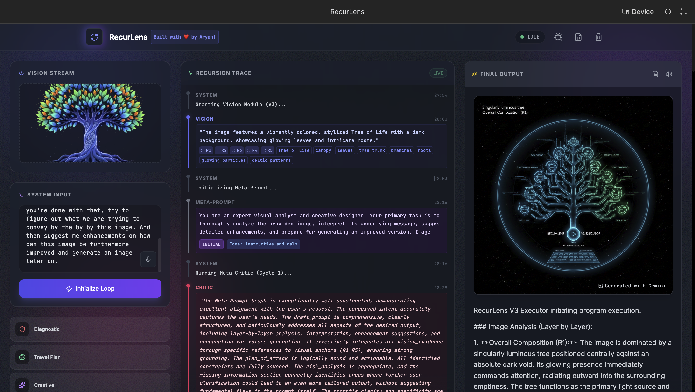
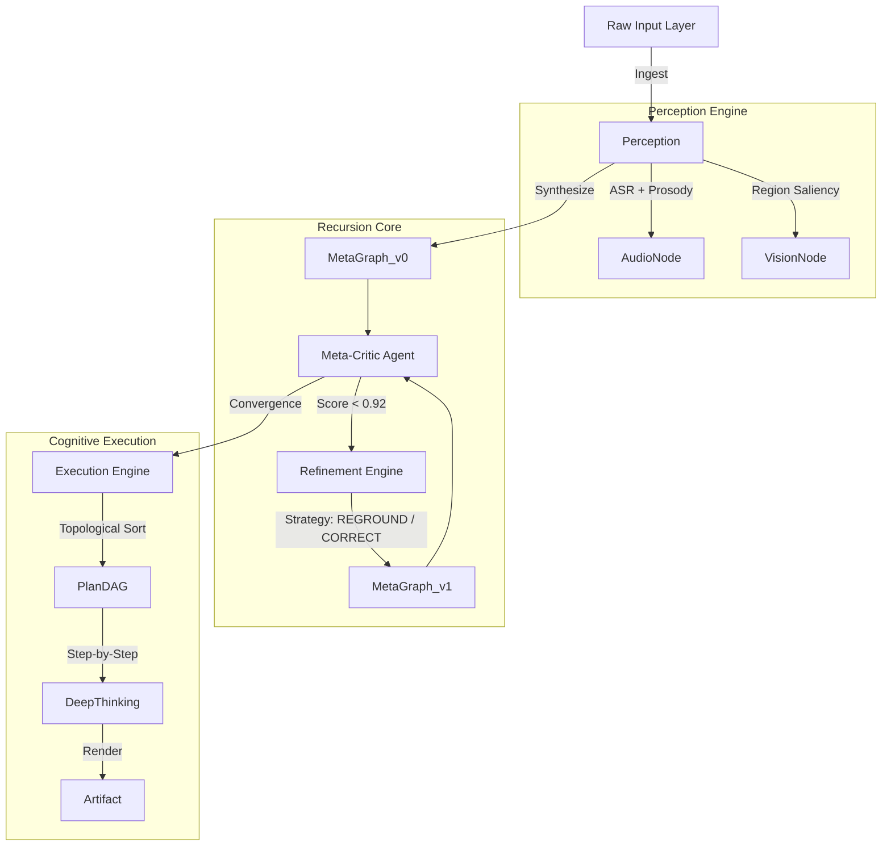
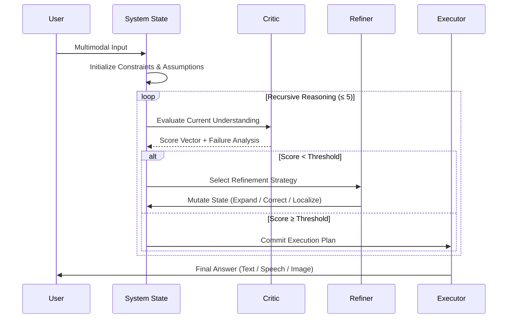

# RecurLens: A Multimodal AI That Thinks Before It Answers

> *From guessing to understanding.*

---

## 1. Abstract

Modern AI systems respond too quickly.

In everyday use, people give vague instructions, incomplete descriptions, or point at things and say *“help me with this.”*
Most assistants immediately guess — often confidently, sometimes dangerously.

**RecurLens is designed to solve this problem.**

RecurLens is a **recursive, multimodal reasoning system** built on Gemini that deliberately pauses before responding. It listens to speech, analyzes images, evaluates ambiguity, and iteratively refines its own understanding before producing an answer.

Instead of mapping *input → output*, RecurLens performs:

> **input → understanding → self-critique → refinement → execution**

This project demonstrates that **inference-time reasoning**, not faster generation, is the key to building AI systems that work reliably in the real world.

---

## 2. System Architecture

RecurLens does not operate as a linear prompt chain.
It maintains an evolving **graph-structured state** that represents what the system believes the user means.

### State Evolution Graph

### Recursion Logic (Sequence)

---

## 3. What Problem This Solves (and Why It Matters)

### A. Everyday Ambiguity

People rarely give precise instructions.
They speak casually, gesture at images, omit constraints, and assume shared context.

RecurLens treats ambiguity as a **first-class signal**, not a failure case.

---

### B. Multimodal Grounding That Actually Grounds

Images are not just appended to context.

The vision system extracts **salient regions** and forces reasoning steps to explicitly reference them.
If the system invents an object or misreads the image, the Critic detects the mismatch and blocks execution.

---

### C. Safety as a Structural Property

Safety is embedded into the reasoning graph itself.

If a scenario is flagged as high-risk (hardware, health, infrastructure), execution is paused until the plan includes explicit mitigation steps or requests user confirmation.

---

### D. Transparency Over Illusion

RecurLens exposes its internal reasoning loop.

Users can observe how the system critiques its own understanding and refines it. This transparency builds trust and highlights how modern multimodal reasoning actually works.

---

## 4. Why is it needed?

RecurLens is only feasible because of recent advances in Gemini:

* Native multimodal reasoning across speech, vision, and text
* Long-context self-reflection
* Fast inference suitable for iterative reasoning
* Tool use (search, image generation, speech synthesis)

This project reframes Gemini not as a chatbot, but as a **thinking substrate**.

---

## 5. Operational Flow

### Prerequisites

A Google Cloud project with Gemini access and billing enabled. RecurLens relies on recursive inference and is designed for paid-tier usage.

### Usage

1. Provide input via speech, image, or text.
2. The system pauses to analyze tone, visual evidence, and ambiguity.
3. Internal reasoning iterations are logged and visualized.
4. Once confidence stabilizes, the final output is produced.

---

## 6. Technical Stack

* **Core Logic**: TypeScript (strict schema validation, immutable state)
* **Frontend**: React + Tailwind (state visualization)
* **Inference**: Google GenAI SDK (Gemini Pro / Flash)
* **Audio**: Web Audio API (ASR + tone analysis)
* **State Management**: Graph-based reasoning history

---

## 7. License

MIT License.

RecurLens is open for experimentation, extension, and critique.
Linear prompting is not sufficient for real-world AI systems — this project explores what comes next.

---
