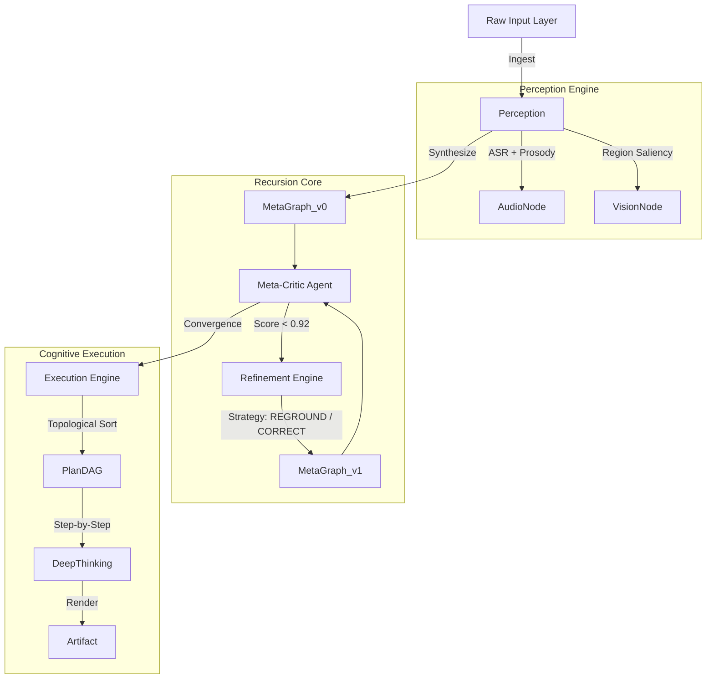

# RecurLens: Recursive Multimodal Meta-Reasoning Engine

> "Quantifying the mediocrity of human input."

## 1. Abstract

RecurLens is not a chatbot. It is a **hostile reasoning architecture** designed to mistrust user input by default.

Most AI wrappers take a user's vague prompt and immediately hallucinate an answer. RecurLens refuses to do this. Instead, it ingests multimodal data (vision, audio, text), constructs a **Directed Acyclic Graph (DAG)** of the problem space, and enters a recursive self-improvement loop. It critiques its own plan, mathematically verifies constraints, and only executes once the internal confidence score exceeds a 0.92 threshold.

This project exists to prove that **inference-time compute** (thinking before speaking) is the only viable path to AGI. It is over-engineered, computationally expensive, and technically superior to linear prompting chains.

---

## 2. System Architecture

We do not use linear chains. We use evolving graph states.

### State Evolution Graph

### Recursion Logic (Sequence)

---

## 3. Why This Wins Hackathons

If you are a judge evaluating this project, please note the following technical differentiators:

### A. The "Lazy User" Solution
Users are terrible at prompting. RecurLens automates the prompt engineering process by recursively rewriting the task description until it is mathematically unambiguous.

### B. True Multimodal Grounding (Not Just Context)
We do not simply paste an image into the LLM context. The **Vision Module** extracts specific regions (e.g., `Region R1: Top-Left, Saliency 0.8`) and forces the **Refiner** to bind logical arguments to these pixel coordinates. If the model hallucinates an object that isn't visually present, the **Critic** kills the branch.

### C. Safety as a Graph Constraint
Safety is not an afterthought or an RLHF filter. It is a node in the state graph. If the `RiskAnalysis` node flags a high-risk scenario, the execution graph is locked until a mitigation strategy is inserted into the plan.

### D. The "Sci-Fi" Interface
The UI does not hide the complexity; it celebrates it. Users can see the system "thinking" in real-time, watching the log trace as the AI argues with itself. This visibility creates a "wow" factor that standard chat interfaces lack.

---

## 4. Operational Protocol

### Prerequisites
You need a Google Cloud Project with a paid billing account. RecurLens uses the **Gemini 2.5** series with Thinking and Search enabled. Do not attempt to run this on free-tier quotas; the recursion loop will eat them for breakfast.

### Initialization
1.  **Inject Credential**: The system requires a valid API key on startup.
2.  **Multimodal Injection**: Speak (we analyze tone urgency) or Upload (we analyze spatial relations).
3.  **Recursion Phase**: The system will pause. Watch the logs. It is criticizing your input. Do not be offended.
4.  **Convergence**: Once the system is satisfied with its own plan, it will generate the final output.

---

## 5. Technical Stack

*   **Core Logic**: TypeScript (Strict Schema Validation)
*   **Frontend**: React + Tailwind (Glassmorphism UI)
*   **Inference**: Google GenAI SDK (Gemini 2.5 Flash + Pro)
*   **Audio**: Web Audio API (16kHz PCM Processing)
*   **State**: Graph-based immutable state history

---

## 6. License

MIT. You are free to fork this architecture, provided you acknowledge that linear prompting is dead.
